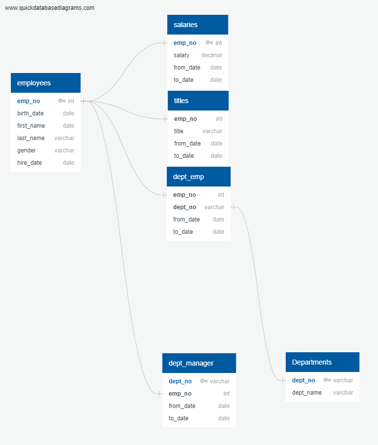

# SQL Challenge Employee Analysis 

## Background

Given the varying CSV files provided listing employees, department associations, titles, and salary, a database was created mapping these files together to perform comprehensive queries. The way these various files are mapped together can be seen in the below figure.

The goal of these queries were:

1. To establish the number of employees expected to retire from each position title.
2. Create a list of qualified employees present in the various departments ready to mentor the next generation of employees.

## Results

The number of retiring employees from each position were found to be:

* Senior Engineer: 25,916
* Senior Staff: 24,926
* Engineer: 9,285
* Staff: 7,636
* Technique Leader: 3,603
* Assistant Engineer: 1,090
* Manager: 2

A breakdown was completed for a summary of the positions set to loose retiring employees, and a similar breakdown showing the number of each position set to be lost by department. Given the 72,458 employees set to retire, an additional query was made to see how many mentors can be expected for each postion/department. A list of the eligible mentors was created. The results by position title can be seen below:

* Senior Engineer: 529
* Senior Staff: 569
* Engineer: 190
* Staff: 155
* Technique Leader: 77
* Assistant Engineer: 29
* Managers: 0

The above results indicate that the number of qualified mentors is far outnumbered by the number of retirees. 

In addition, there are no qualified managers to mentor incoming staff taking over the vacant positions.

## Summary

The number of mentors is far outnumbered by the number of retirees. This may lead to a skills gap during the hiring process filling these vacancies. All position titles have mentors available, with the exception of managers.

These results lead to further questions. Which departments will see the largest impact? Which departments will have the most mentors available? Given the salaries of the positions, which positions will be most difficult to fill? These could be fullfilled by additional queries joining salary information to the title, and providing more detailed outputs including the department information by employee and title.

